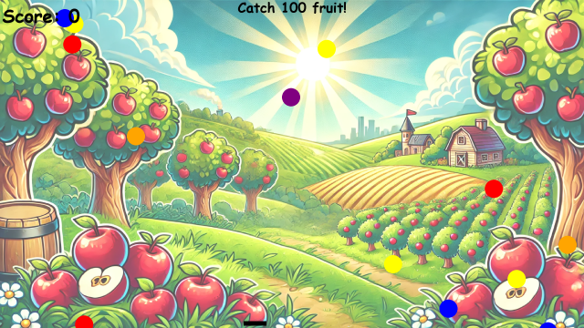

# Catch the Falling Fruit!



**Catch the Falling Fruit!** is a fun and interactive game developed in Python using the Pygame library. In this game, fruits fall from the top of the screen and your goal is to catch them with a basket at the bottom. The game scales in difficulty as your score increases and offers both manual and automatic modes.

A standalone Windows executable built with PyInstaller is available in the [Releases](https://github.com/codingfossai/fruits/releases) section of this repository.

Repository: [https://github.com/codingfossai/fruits](https://github.com/codingfossai/fruits)

---

## Features

- **Dynamic Gameplay:**  
  The falling speed of the fruits increases as your score rises, making the game progressively more challenging.

- **Automatic Mode:**  
  Toggle automatic mode by pressing the **Space Bar**. In automatic mode, the basket is controlled by the computer and moves toward the falling fruits—but its speed is limited (by the `AUTO_SPEED` constant), so not every fruit will be caught.

- **Custom Winning Score:**  
  You can set a custom winning score via a command-line argument when launching the game. If no score is provided, the default winning score is **100**.

- **Sound Effects and Visuals:**  
  Enjoy happy, sad, and winning sound effects, along with explosion animations when fruits are caught and a faded background image for a softened look.  
  *Note:* The sound effects are sourced from [pixabay.com](https://pixabay.com/) and are provided under the [Pixabay License](https://pixabay.com/service/license-summary).

- **Pre-built Executable:**  
  A standalone executable for Windows 10 is provided under the repository’s [Releases](https://github.com/codingfossai/fruits/releases) tab.

---

## Installation

### Prerequisites

- [Python 3.12+](https://www.python.org/downloads/)
- [Pygame](https://www.pygame.org/)

### Installing Dependencies

Clone the repository and install the required packages using pip:

```bash
git clone https://github.com/codingfossai/fruits.git
cd fruits
pip install -r requirements.txt
```

The `requirements.txt` file contains:

```txt
pygame>=2.6.1
```

*If you plan on packaging the game with PyInstaller (optional), you may also install:*

```txt
pyinstaller>=5.8.0
```

---

## Running the Game

### From Source

You can launch the game from source using:

```bash
python fruits.py
```

To set a custom winning score (for example, 50), run:

```bash
python fruits.py 50
```

If no argument is provided, the game defaults to a winning score of 100.

### Using the Executable

Download the pre-built Windows executable from the [Releases](https://github.com/codingfossai/fruits/releases) section and run it on your Windows 10 machine.

---

## Controls

- **Mouse Movement (Manual Mode):**  
  Move the basket by moving your mouse horizontally.

- **Space Bar:**  
  Toggle between manual and automatic modes. In automatic mode, the basket moves toward the falling fruits automatically (with its speed limited by the `AUTO_SPEED` constant).

- **Escape:**  
  Press `Esc` to exit the game.

---

## Building Your Own Executable

If you wish to build the executable yourself, you can use [PyInstaller](https://www.pyinstaller.org/). First, install PyInstaller:

```bash
pip install pyinstaller
```

Then run:

```bash
pyinstaller --onefile --windowed \
  --add-data "background.webp;." \
  --add-data "happy.mp3;." \
  --add-data "sad.mp3;." \
  --add-data "winning.mp3;." \
  fruits.py
```

The executable will be created in the `dist` folder.

---

## Credits

- **Game Code:**  
  The code for this game was generated by OpenAI's **o3-mini-high** model.

- **Background Image:**  
  The background image was created by OpenAI's **DALL-E** model.

- **Sound Effects:**  
  The sound effects are sourced from [pixabay.com](https://pixabay.com/) and are provided under the [Pixabay License](https://pixabay.com/service/license-summary).

---

## Repository Structure

- `fruits.py`: Main game script.
- `requirements.txt`: List of Python dependencies.
- **Resource Files:**
  - `background.webp`: Background image.
  - `happy.mp3`, `sad.mp3`, `winning.mp3`: Sound files.
  - `fruitsscreenshot.PNG`: Screenshot of the game.
- `README.md`: This file.

---

## License

This project is licensed under the **GNU Affero General Public License v3.0**. See the [LICENSE](LICENSE) file for details.

---

## Contributing

Contributions are welcome! Please feel free to open issues or submit pull requests with improvements or fixes.

---

Enjoy the game and happy fruit catching!
